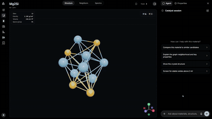

# Catalyst

> **An AI-native scientific workspace that connects materials, evidence, and genomics in one guided investigation.**

## 🎬 Featured demo

## 🎥 [Watch the full-quality Catalyst demo with audio on YouTube](https://youtu.be/yZntqfwqbaE)

[](https://youtu.be/yZntqfwqbaE)

*Inline preview above · click to watch the full audio-enabled recording on YouTube.*

Catalyst turns dense scientific records into an interactive investigation. It combines material discovery tools—3D crystal structures, spectra, properties, and evidence graphs—with a context-aware genomics explorer that understands the DNA window currently on screen.

### From Sunscreen to DNA

Our guided demo follows one clear scientific story:

1. Open zinc oxide (ZnO), a UV-blocking sunscreen material.
2. Watch stored atomic coordinates assemble into its 3D crystal structure.
3. Follow a two-hop evidence graph and a cached optical-response spectrum.
4. Transition to BRCA1, assemble a bounded DNA helix, and focus a displayed variant.
5. Finish with a concise Sunlight Protection Science Brief.

Catalyst acts like a capable scientific copilot: it narrates the investigation, drives the interface step by step, and stays grounded in the active material or genomic context.

## Why Catalyst stands out

- **One coherent scientific workspace.** Materials exploration and genomics become one visual flow rather than disconnected tools.
- **Grounded, inspectable AI.** The agent works from the selected material, graph neighborhood, structure payload, and visible genome state.
- **Built for understanding.** Interactive 3D structure, graph navigation, spectra, sequence windows, and narrated actions make scientific data tangible.
- **Fast and resilient for live demos.** The flagship experience uses deterministic local data and cached visual payloads, avoiding dependence on a remote model or external materials API.
- **Future-ready architecture.** The genome-state model can support TP53, EGFR, CFTR, and additional genes without changing the integration pattern.

## Core platform

AI-native **materials discovery workspace**: go from a natural-language requirement to screened candidates, graph context, structure inspection, and agent-driven research — all against a local Materials Project–class snapshot.

This repository is the public product source: [github.com/Aditya24123/demo](https://github.com/Aditya24123/demo).

### What it does

- **Screen** a local processed Materials Project snapshot with natural language and structured filters.
- **Explore** material neighborhoods on a force graph with edges, evidence, and candidate sets.
- **Inspect** crystal structures (3D), thermo/electronic/magnetic/mechanical properties, spectra when present, and provenance.
- **Work in projects** — named workspaces with sessions, notebook entries, files, and runs (FastAPI project API + UI shell).
- **Chat with an agent** that calls grounded backend tools (search, screen, open materials, compare, export) rather than free-form invention.
- **Research mode** (optional) for literature-style queries and ingest when provider/source keys are configured.
- **Voice** live path over WebSocket when a voice-capable provider is configured.

## Architecture

```text
browser / Vite UI
  → FastAPI (local_api) on :8766
  → DuckDB + parquet/jsonl processed snapshot
  → agent loop + provider adapters (Gemini, Groq, Mistral, NVIDIA, Ollama, …)
```

| Path | Role |
|------|------|
| `code/frontend/` | React 19 + Vite workspace UI (`App` → `SubmissionShell` → `WorkspaceShell`) |
| `code/backend/pipeline/catalyst/` | FastAPI app, local store, screening, graph, projects, agent tools, voice |
| `code/backend/codex-service/` | Optional Node Codex runner for project workspace runs |
| `code/backend/tests/` | Backend contract and recovery tests |
| `data/processed/catalyst/v2025.09.25/` | **Not in git** — place the processed snapshot here to run fully offline |
| `data/local/` | Runtime state (sessions, logs, exports); only examples/templates committed |
| `docs/` | Runbook, API contract, deployment, demo prompts |
| `scripts/` | CLI helpers (e.g. Pages runtime-config updater) |

Default ports: **backend `8766`**, **frontend `5173`**.

## Requirements

- **Python 3.11+**
- **Node.js 20+** (frontend)
- Processed Catalyst snapshot at `data/processed/catalyst/v2025.09.25/` (not shipped in this repo; see `data/README.md`)
- Optional: provider API keys via environment (see `.env.example`) for agent, research, and voice features

## Quick start

```bash
git clone https://github.com/Rtx09x/catalyst.git
cd catalyst
```

### 1. Processed data

Provide the release snapshot (same layout the backend expects):

```text
data/processed/catalyst/v2025.09.25/
  materials.parquet
  material_*.jsonl / *.parquet
  graph/
  resolver/
  build_manifest.json
```

### 2. Backend

```bash
python -m venv .venv
# Windows: .venv\Scripts\activate
source .venv/bin/activate

pip install -r code/backend/pipeline/requirements-runtime.txt

export PYTHONPATH=code/backend/pipeline          # PowerShell: $env:PYTHONPATH = "code/backend/pipeline"
export CATALYST_REPO_ROOT=$(pwd)                # PowerShell: $env:CATALYST_REPO_ROOT = (Get-Location).Path

python -m catalyst.local_api
```

Health check: `http://127.0.0.1:8766/health` → `{"status":"ok", ...}`.

### 3. Frontend

```bash
cd code/frontend
npm install
npm run dev
```

Open `http://127.0.0.1:5173`.

### Windows launcher (optional)

From the repo (with dependencies and data already in place):

```powershell
.\code\start_catalyst.ps1
```

Or the thin wrappers `.\catalyst.ps1` / `.\catalyst.sh` (via `scripts/catalyst.py`).

If `code/frontend/public/runtime-config.json` sets a non-empty `apiBaseUrl`, the launcher uses that remote API instead of starting a local backend. The **committed** file keeps `apiBaseUrl` empty so private hosts are not published.

## Configuration

| Item | Notes |
|------|--------|
| `data/local/settings.example.json` | Shape for runtime settings; copy/adapt to `data/local/settings.json` (gitignored) |
| `.env.example` | Provider and research keys (`GEMINI_API_KEY`, `GROQ_API_KEY`, …) — never commit real `.env` |
| `runtime.source_release` | Defaults to `v2025.09.25` |
| `code/frontend/public/runtime-config.json` | Optional `{ "apiBaseUrl": "https://…" }` for a hosted backend |

## Verification

```bash
export PYTHONPATH=code/backend/pipeline
export CATALYST_REPO_ROOT=$(pwd)

pytest -q code/backend/tests
npm run build --prefix code/frontend
python code/backend/pipeline/scripts/check_ship_ready.py
```

## What is not in this repository

- Large **processed materials snapshot** (`data/processed/`)
- **Runtime state**: sessions, logs, exports, real settings, research runs
- **Secrets** and local agent/tooling scratch (`.venv`, `node_modules`, `dist`, `graphify-out`, etc.)

See `.gitignore` for the full list.

## Docs

| Doc | Contents |
|-----|----------|
| [docs/RUNBOOK.md](docs/RUNBOOK.md) | Startup, preflight, ports, settings |
| [docs/API_CONTRACT.md](docs/API_CONTRACT.md) | Backend surface used by the UI |
| [docs/DEPLOYMENT.md](docs/DEPLOYMENT.md) | Hosting (server + tunnel / Tailscale / Pages) |
| [docs/DEMO_PROMPTS.md](docs/DEMO_PROMPTS.md) | Reliable demo queries |
| [docs/ROOT_LAYOUT.md](docs/ROOT_LAYOUT.md) | Repository layout |
| [docs/SUBMISSION_PACK.md](docs/SUBMISSION_PACK.md) | Demo / submission notes |
| [data/README.md](data/README.md) | Data placement |

## License

No license file is published in this tree yet; treat usage as source-available until one is added.
